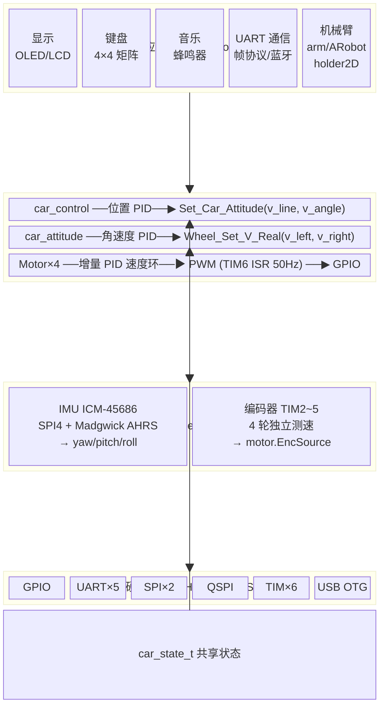
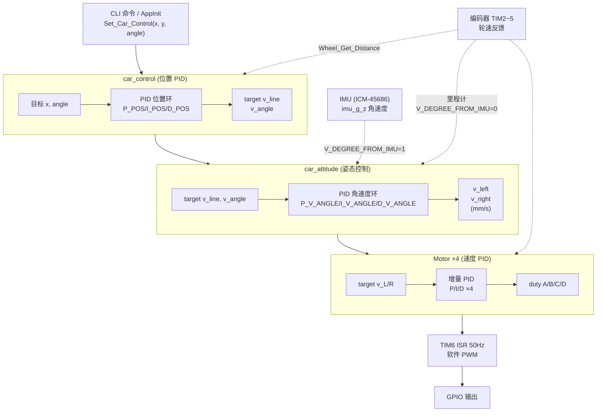
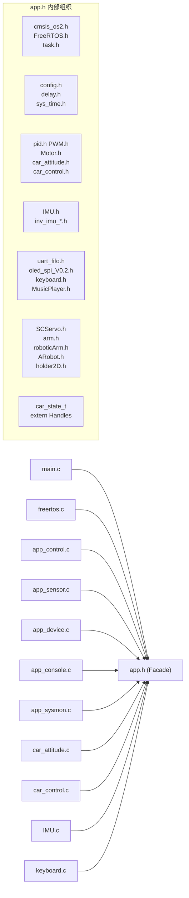
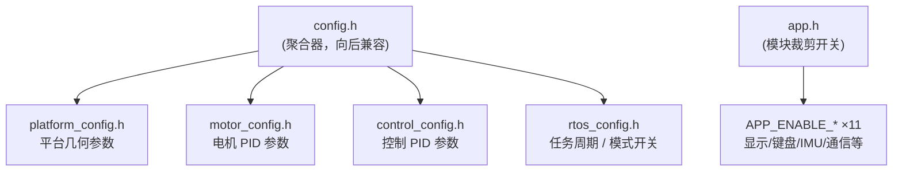
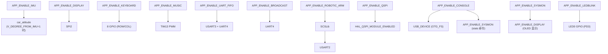
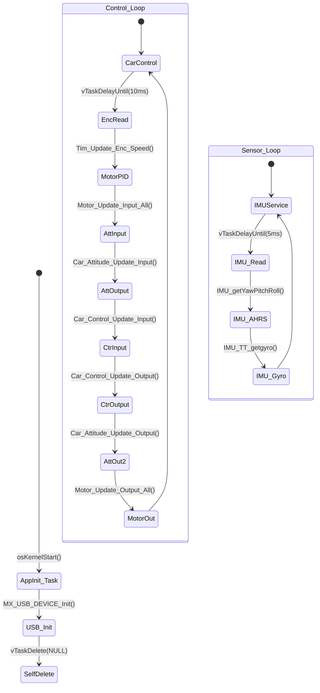
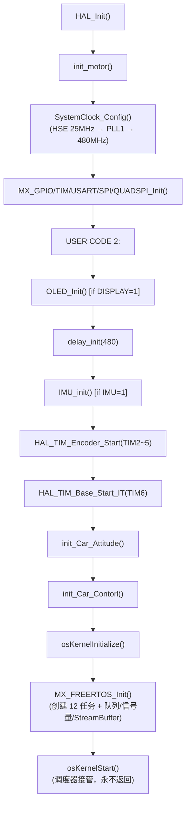
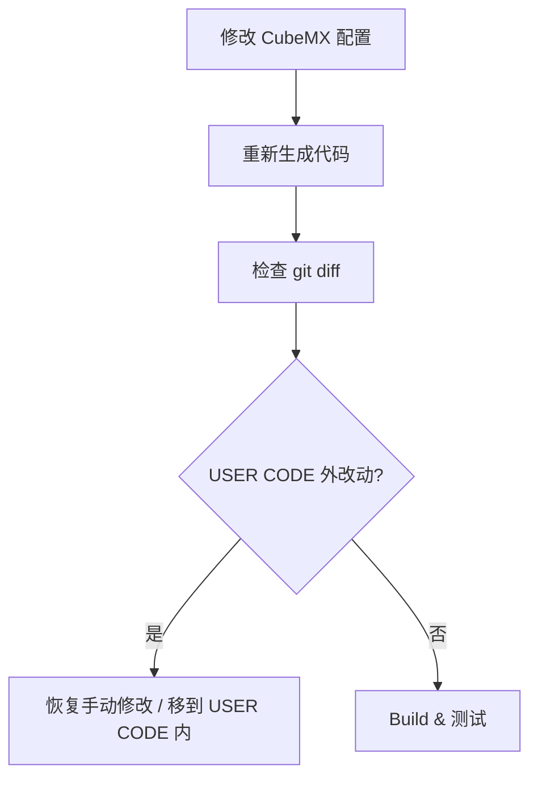
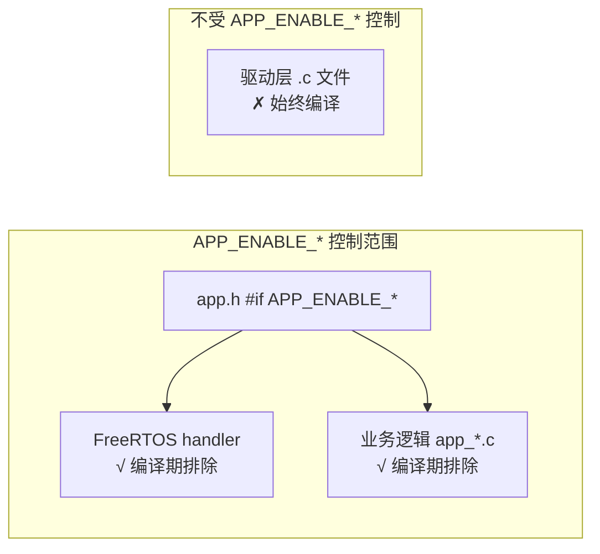

# Celebright 小车控制板开发模板

基于 STM32H750VBT6 (Cortex-M7 @ 480MHz) + FreeRTOS V10.3.1 的四轮机器人运动控制开发平台。遵循"高内聚、低耦合"原则设计，采用 Facade 模式 (`app.h`) 统一模块入口，支持 11 路编译期功能裁剪。

---

## 目录

1. [硬件平台](#1-硬件平台)
2. [快速开始](#2-快速开始)
3. [软件架构](#3-软件架构)
4. [配置系统](#4-配置系统)
5. [模块剪裁指南](#5-模块剪裁指南)
6. [FreeRTOS 任务配置](#6-freertos-任务配置)
7. [CLI 命令行](#7-cli-命令行)
8. [外设与 Pin Map](#8-外设与-pin-map)
9. [CubeMX 代码生成规范](#9-cubemx-代码生成规范)
10. [开发流程](#10-开发流程)
11. [重构记录](#11-重构记录)
12. [已知局限 & 待改进](#12-已知局限--待改进)

---

## 1. 硬件平台

| 类别 | 项目 | 规格 |
|------|------|------|
| **主控** | MCU | STM32H750VBT6 (Cortex-M7, 480MHz, LQFP100, 128KB Flash + 1MB ROM) |
| **传感器** | IMU | ICM-45686 6 轴 (SPI4, 15Mbps) |
| | 编码器 | 4× 增量编码器 (TIM2~TIM5, 16/32-bit) |
| **执行器** | 电机 | 4× 直流电机 (H 桥驱动, 软件 PWM 50Hz) |
| | 舵机 | SCS/FT 串行总线舵机 (USART2, 1Mbps) |
| | 蜂鸣器 | 无源蜂鸣器 (TIM13 PWM) |
| | 激光 | 2× 激光 (GPIO) |
| **存储** | Flash | W25Q256 32MB (QSPI BK1, 内存映射 0x90000000) |
| **显示** | OLED | SSD1306 128×64 (SPI2, 25Mbps) |
| | LCD | ST7789 240×280 TFT (SPI2 共用) |
| **输入** | 键盘 | 4×4 矩阵键盘 (8 GPIO) |
| **通信** | USB | OTG FS → Virtual COM Port (CDC ACM) |
| | UART | USART1 (printf 调试), USART3/UART4 (帧协议), UART5 (预留) |
| **调试** | SWD | PA13 (SWDIO), PA14 (SWCLK) |
| **指示** | LED | 4× LED (LED0~LED3) |

---

## 2. 快速开始

### 2.1 编译环境

- **IDE**: Keil MDK-ARM V5 (ARM Compiler V5.06 update 7)
- **Device Pack**: Keil.STM32H7xx_DFP.4.1.3
- **CubeMX**: STM32CubeMX 6.x (用于管脚/外设配置，生成后需按 §9 恢复用户代码)

### 2.2 编译与烧录

```
1. 打开 MDK-ARM\STMH750VBT6_Celebright_V3.uvprojx
2. 选择 Target: STMH750VBT6_Celebright_V3
3. Build (F7) → 生成 .axf / .hex
4. 通过 SWD (PA13/PA14) 烧录
```

### 2.3 连接 CLI

```
1. USB 连接 MCU 的 OTG_FS 口到 PC
2. PC 端识别为 Virtual COM Port (CDC ACM)
3. 打开串口终端 (PuTTY / TeraTerm / 任意)，波特率忽略 (CDC 无视波特率)
4. 按 Enter → 显示 "Celebright CLI" 提示符
5. 输入 help 查看命令列表
```

---

## 3. 软件架构

### 3.1 分层架构



### 3.2 控制数据流



### 3.3 Facade 模式 — `app.h`

所有 CubeMX 自动生成的 `.c` 文件（`main.c`、`freertos.c`）在 USER CODE 区域仅 `#include "app.h"` 一行（CubeMX 自动生成区域仍保留 `main.h`、`FreeRTOS.h`、`cmsis_os2.h` 等系统头文件）。



**Thin wrapper 头文件**（每个域一个，内部仅 `#include "app.h"`）：

| Wrapper | 覆盖域 | 文件 |
|---------|--------|------|
| `app_common.h` | Common (config, delay, sys_time) | `Core/Inc/app_common.h` |
| `app_control.h` | Control (pid, PWM, Motor, car_*) | `Core/Inc/app_control.h` |
| `app_sensor.h` | Sensor (IMU, encoders) | `Core/Inc/app_sensor.h` |
| `app_device.h` | Device (display, keyboard, uart, music) | `Core/Inc/app_device.h` |
| `app_robot.h` | Robot (SCSLib, arm, holder2D) | `Core/Inc/app_robot.h` |
| `app_console.h` | CLI console | `Core/Inc/app_console.h` |
| `app_sysmon.h` | System monitor | `Core/Inc/app_sysmon.h` |
| `app_qspi.h` | QSPI Flash + LittleFS | `Core/Inc/app_qspi.h` |
| `app_rtos_hooks.h` | RTOS hook functions | `Core/Inc/app_rtos_hooks.h` |

---

## 4. 配置系统

### 4.1 配置分层



### 4.2 platform_config.h — 平台几何参数

| 宏 | 值 | 含义 |
|----|-----|------|
| `WHEEL_DIR` | 47.0 mm | 轮径 |
| `WHEEL_PERIMETER` | 148.723 mm | 轮周长 |
| `FRAME_W_HALF` | 66.25 mm | 左右轮距的一半 |
| `FRAME_L_HALF` | 55.85 mm | 前后轴距的一半 |
| `ENC_EVERY_CIRCLE` | 1061.268 | 每圈编码器脉冲数 |
| `USE_4_MOTOR` | 1 | 四轮驱动（1）或两轮（0） |
| `USE_4_TIMES_ENCODER` | 1 | 编码器四倍频 |
| `MAX_V_ENC` | ~2122 enc/s | 编码器速度上限 |
| `MAX_V_REAL` | ~299 mm/s | 最大线速度 |
| `MAX_V_ANGLE` | 60.0 °/s | 最大角速度 |

### 4.3 motor_config.h — 电机 PID

```c
#define P_LF  0.02F    I_LF  0.01F    D_LF  0.015F   // 左前 LF
#define P_LR  0.02F    I_LR  0.01F    D_LR  0.015F   // 左后 LR
#define P_RF  0.02F    I_RF  0.01F    D_RF  0.015F   // 右前 RF
#define P_RR  0.02F    I_RR  0.01F    D_RR  0.015F   // 右后 RR

#define MAX_MOTOR_DUTY  0.999F      // PWM 最大占空比
#define ZOOM_PID_TO_DUTY 0.001F      // PID 输出到占空比缩放
```

### 4.4 control_config.h — 控制 PID

| 环 | P | I | D | 输出限幅 |
|----|---|---|---|----------|
| 位置环 (`pid_line_pos`) | 2.0 | 0.01 | 0.1 | ±`MAX_V_REAL` |
| 旋转环 (`pid_spin`) | 2.0 | 0.01 | 0.5 | ±`MAX_V_ANGLE` |
| 角速度环 (`pid_v_angle`) | 1.0 | 0.63 | 0.01 | ±`MAX_V_ANGLE × FRAME_W_HALF × DEGREE_TO_RAD` |

### 4.5 rtos_config.h — 任务周期与模式开关

| 宏 | 默认 | 含义 |
|----|------|------|
| `TASK_ITV_CAR` | 10 ms | 控制任务执行周期 |
| `TASK_ITV_IMU` | 5 ms | IMU 传感器任务执行周期 |
| `TASK_ITV_UPLOAD` | 50 ms | 数据上传间隔 |
| `USE_CAR_CONTROL` | 1 | 1=位置 PID 闭环, 0=仅姿态环 (直接控制 car_attitude) |
| `V_ANGLE_PID` | 1 | 1=角速度 PID 闭环, 0=开环角速度换算 |
| `V_DEGREE_FROM_IMU` | 1 | 1=IMU 陀螺仪为角速度来源, 0=编码器差速计算角速度 |

### 4.6 app.h — 模块裁剪开关

参见 [§5 模块剪裁指南](#5-模块剪裁指南)。

### 4.7 FreeRTOSConfig.h — 内核参数

| 参数 | 值 | 说明 |
|------|-----|------|
| `configCPU_CLOCK_HZ` | `SystemCoreClock / 2` (240MHz) | SysTick 时钟 = HCLK |
| `configTICK_RATE_HZ` | 1000 Hz | Tick 周期 = 1 ms |
| `configTOTAL_HEAP_SIZE` | 81920 bytes | FreeRTOS 动态堆 (heap_4) |
| `configMAX_PRIORITIES` | 56 | 最大优先级数 |
| `configMINIMAL_STACK_SIZE` | 128 words | 最小任务栈 (512 bytes) |
| `configUSE_PREEMPTION` | 1 | 抢占式调度 |
| `configSUPPORT_STATIC_ALLOCATION` | 1 | 静态内存分配 |
| `configSUPPORT_DYNAMIC_ALLOCATION` | 1 | 动态内存分配 |
| `configCHECK_FOR_STACK_OVERFLOW` | 2 | 栈溢出检测 (方法 2) |
| `configGENERATE_RUN_TIME_STATS` | 1 | 运行时统计 (DWT→CYCCNT >> 8) |
| `configUSE_MUTEXES` | 1 | 互斥锁 |
| `configUSE_COUNTING_SEMAPHORES` | 1 | 计数信号量 |
| `configUSE_RECURSIVE_MUTEXES` | 1 | 递归互斥锁 |
| `INCLUDE_vTaskDelete` | 1 | 任务删除 API |
| `configLIBRARY_MAX_SYSCALL_INTERRUPT_PRIORITY` | 5 | ISR 可安全调用 FreeRTOS API 的最高优先级 |

---

## 5. 模块剪裁指南

### 5.1 模块开关速查表

所有开关位于 `Core/Inc/app.h`（`rtos_config.h` 中的控制模式开关不在此表重复）。

| # | 模块 | 开关宏 | 默认 | 影响范围 |
|---|------|--------|------|----------|
| 1 | IMU 传感器 | `APP_ENABLE_IMU` | 1 | IMU 驱动 (ICM-45686) + Madgwick AHRS + IMU 数据采集任务 |
| 2 | 显示 | `APP_ENABLE_DISPLAY` | 1 | OLED/LCD 驱动 + 显示服务 + Display 任务 |
| 3 | 矩阵键盘 | `APP_ENABLE_KEYBOARD` | 1 | 键盘扫描任务 + queue_key 消息队列 |
| 4 | 蜂鸣器音乐 | `APP_ENABLE_MUSIC` | 0 | 音乐播放任务 + semphr_buzzer_trigger |
| 5 | UART 帧通信 | `APP_ENABLE_UART_FIFO` | 1 | UART3/UART4 帧协议 + 接收任务 + 队列 |
| 6 | 蓝牙广播 | `APP_ENABLE_BROADCAST` | 0 | UART4 蓝牙广播任务 |
| 7 | 机械臂子系统 | `APP_ENABLE_ROBOTIC_ARM` | 0 | arm/ARobot/roboticArm/holder2D + SCSLib |
| 8 | QSPI Flash | `APP_ENABLE_QSPI` | 0 | W25Q256 + LittleFS 文件系统 |
| 9 | CLI 控制台 | `APP_ENABLE_CONSOLE` | 1 | USB CDC CLI (FreeRTOS+CLI) + StreamBuffer |
| 10 | 系统监视器 | `APP_ENABLE_SYSMON` | 1 | 堆/栈水位显示 + 运行时统计 |
| 11 | LED 闪烁 | `APP_ENABLE_LEDBLINK` | 1 | LED0 1Hz 心跳 |
| — | 显示类型 | `APP_DISPLAY_TYPE` | `DISPLAY_TYPE_OLED` | OLED (0) 或 LCD (1) |

> **注意**: CubeMX 生成的 FreeRTOS 任务静态内存（任务栈 + 控制块）**不受** `APP_ENABLE_*` 控制。
> 禁用某模块后，对应任务会在启动时调用 `vTaskDelete(NULL)` 自删除，但栈空间不回收。
> 如需完全回收 RAM，还需在 CubeMX → FreeRTOS → Tasks 中手动删除对应任务。

### 5.2 模块依赖图



### 5.3 典型裁剪场景

#### 场景 A：纯底盘（电机 + 编码器 + IMU，无显示/通信/机械臂）

```c
// Core/Inc/app.h
#define APP_ENABLE_DISPLAY      0
#define APP_ENABLE_KEYBOARD     0
#define APP_ENABLE_MUSIC        0
#define APP_ENABLE_UART_FIFO    0
#define APP_ENABLE_BROADCAST    0
#define APP_ENABLE_ROBOTIC_ARM  0
#define APP_ENABLE_QSPI         0
#define APP_ENABLE_CONSOLE      0
#define APP_ENABLE_SYSMON       0
// 保留: APP_ENABLE_IMU=1, APP_ENABLE_LEDBLINK=1
```

CubeMX 中手动删除对应的 FreeRTOS Tasks 以回收 RAM（约 10KB）。

#### 场景 B：全功能调试（所有模块启用，默认配置）

```c
// 不做任何修改，所有 APP_ENABLE_* 保持默认值
// 通过 CLI (USB CDC) 交互: help, stats, car, sys, flash 等
```

#### 场景 C：无 IMU 模式（使用编码器差速计算角速度）

```c
// Core/Inc/rtos_config.h
#define V_DEGREE_FROM_IMU   0   // 使用编码器差速替代 IMU 角速度

// Core/Inc/app.h
#define APP_ENABLE_IMU      0   // 完全禁用 IMU 模块
```

### 5.4 剪裁审计状态

所有 11 个开关均已通过编译期和运行时验证。已知局限：

| 局限 | 影响 | 缓解方式 |
|------|------|----------|
| CubeMX 任务栈不回收 | 禁用 10 个任务浪费 ~10KB RAM | CubeMX 中手动删除任务 |
| 驱动层代码不裁剪 | `lcd_*.c`/`inv_imu_*.c`/`SCSLib/*.c`/`lfs*.c` 始终编译 (~100KB Flash) | Keil 项目中手动排除文件 |
| `APP_ENABLE_UART_FIFO` 同时控制 USART1 帧协议 | 设计耦合，无独立开关 | 需拆分 USART1 为独立开关 |
| `APP_ENABLE_SYSMON` 依赖 `APP_ENABLE_CONSOLE` 提供 `stats` 命令 | SYSMON=1 但 CONSOLE=0 时无命令行访问 | 通过 OLED 显示作为替代 |

---

## 6. FreeRTOS 任务配置

### 6.1 任务列表

| 任务名 | CubeMX 名 | 优先级 | 栈 | 周期 | 所属域 | 服务函数 |
|--------|-----------|--------|-----|------|--------|----------|
| `IMUService` | IMUService | Normal3 (27) | 128W | 5ms | Sensor | `AppIMUService_Task` |
| `CarControl` | CarControl | Normal5 (29) | 128W | 10ms | Control | `AppCarControl_Task` |
| `KeyScan` | KeyScan | Normal6 (30) | 128W | idle | Device | `AppKeyScan_Task` |
| `LEDBlink` | LEDBlink | AboveNormal (32) | 128W | 1s | System | (inline) |
| `Uart3Rx` | Uart3Rx | Normal7 (31) | 256W | block | Device | `AppUart3Rx_Task` |
| `Uart4Rx` | Uart4Rx | Normal7 (31) | 256W | block | Device | `AppUart4Rx_Task` |
| `Broadcast` | Broadcast | Normal1 (25) | 256W | 50ms | Device | `AppBroadcast_Task` |
| `Display` | Display | Normal1 (25) | 128W | 100ms | Device | `AppDisplay_Task` |
| `Buzzer` | Buzzer | Normal1 (25) | 128W | idle | Device | `AppBuzzer_Task` |
| `Reserved` | Reserved | Normal1 (25) | 1024W | 50ms | — | `AppReserved_Task` |
| `SysMon` | SysMon | Low (8) | 512W | 200ms | System | `AppSysMon_Task` |
| `Console` | Console | Normal1 (25) | 512W | block | System | `AppConsole_Task` |
| `AppInit` | (xTaskCreate) | Normal5 (29) | 512W | once | Init | `AppInit_Task` |

> **栈单位**: W = words (32-bit), 1W = 4 bytes. 128W = 512B, 256W = 1KB, 512W = 2KB, 1024W = 4KB.

### 6.2 RTOS 同步对象

| 对象 | 创建方式 | 参数 | 用途 |
|------|---------|------|------|
| `queue_keyHandle` | CubeMX CMSIS MessageQ | 1 × char | 按键字符传递 |
| `uart3_frame_queue` | RTOS_QUEUES `xQueueCreate` | 5 × 64B | UART3 帧缓冲 |
| `uart4_frame_queue` | RTOS_QUEUES `xQueueCreate` | 5 × 64B | UART4 帧缓冲 |
| `console_rx_stream` | RTOS_QUEUES `xStreamBufferCreate` | 256B, trigger=1 | USB CDC RX → Console |
| `semphr_buzzer_trigger` | CubeMX Binary Semaphore | initial=1, max=1 | 蜂鸣器触发 |
| `semphr_uart_receive` | CubeMX Counting Semaphore | max=16, initial=0 | UART 接收通知 |

### 6.3 中断优先级

| IRQ | 优先级 | 是否调用 FreeRTOS API | 说明 |
|-----|--------|----------------------|------|
| TIM6_DAC | 5 | 否 | 软件 PWM 时基 (40kHz) |
| USART3 | 5 | 是 (`xQueueSendFromISR`) | UART3 帧接收 |
| UART4 | 5 | 是 (`xQueueSendFromISR`) | UART4 帧接收 |
| OTG_FS | 5 | 是 (`xStreamBufferSendFromISR`) | USB CDC 接收 |
| SysTick | 15 | 是 (FreeRTOS 内部) | 系统 Tick (1kHz) |
| PendSV | 15 | 是 (FreeRTOS 内部) | 上下文切换 |

> **规则**: FreeRTOS API FromISR 函数仅可在优先级 **5-15** 的 ISR 中调用。优先级 0-4 的 ISR 不得调用任何 FreeRTOS API（`configLIBRARY_MAX_SYSCALL_INTERRUPT_PRIORITY = 5`）。

### 6.4 任务状态变迁



---

## 7. CLI 命令行

通过 USB Virtual COM Port (CDC ACM) 访问。FreeRTOS+CLI 提供命令注册、参数解析、内建 `help`。

### 7.1 内置命令

| 命令 | 参数 | 功能 | 实现 |
|------|------|------|------|
| `help` | — | 列出所有已注册命令及帮助 | FreeRTOS+CLI 内建 `prvHelpCommand` |
| `tasks` | — | 列出所有 FreeRTOS 任务及状态 | `vTaskList()` |
| `stats` | — | 运行时 CPU 占用统计 | `vTaskGetRunTimeStats()` |
| `sys` | — | 系统摘要 (堆剩余、任务栈水位) | `AppSysMon_*` |
| `flash` | `mount\|umount\|format\|ls\|cat\|info` | QSPI Flash + LittleFS 管理 | `AppQSPI_*` |

### 7.2 小车控制命令

| 命令 | 参数 | 功能 | API 调用 |
|------|------|------|----------|
| `car` | (无参) | 显示帮助 | — |
| `car go <mm>` | 距离 (mm) | 直行 N 毫米 | `Set_Car_Control(mm, 0, 0)` |
| `car spin <deg>` | 角度 (°) | 原地旋转 N 度 | `Set_Car_Control(0, 0, deg)` |
| `car arc <mm> <deg>` | 距离 + 角度 | 弧线运动 | `Set_Car_Control(mm, 0, deg)` |
| `car stop` | — | 立即停止 | `Set_Car_Control(0, 0, 0)` |
| `car start` | — | 恢复运动 | `Set_Car_Start()` |
| `car speed <mm/s>` | 线速度 (mm/s) | 直接设速度 (0 = 停) | `Set_Car_Attitude(v, 0)` |
| `car status` | — | 显示当前姿态和速度 | 读取 `car_state_t` |

### 7.3 使用示例

```
> help
help: Lists all the registered commands
tasks: List all tasks
stats: Runtime CPU stats
sys: System summary (heap/stack)
flash [mount|umount|format|ls|cat|info]: QSPI Flash
car [go|spin|arc|stop|start|speed|status]: Car motion control
> 
> car status
--- Car Status ---
Yaw:     12.5 deg (total    12.5, circles 0)
V_Lin:    0.0 /    0.0 mm/s  (cur / tgt)
V_Ang:    0.0 /    0.0 deg/s (cur / tgt)
Stop:  YES
> 
> car go 500
Car: go 500.0 mm
> 
> car spin 90
Car: spin 90.0 deg
>
```

---

## 8. 外设与 Pin Map

### 8.1 定时器

| 定时器 | 模式 | 通道/引脚 | 用途 |
|--------|------|-----------|------|
| TIM2 | Encoder 32-bit | CH1: PA15, CH2: PB3 | 左后轮编码器 |
| TIM3 | Encoder 16-bit | CH1: PC6, CH2: PC7 | 左前轮编码器 |
| TIM4 | Encoder 16-bit | CH1: PD12, CH2: PB7 | 右前轮编码器 |
| TIM5 | Encoder 32-bit | CH1: PA0, CH2: PA1 | 右后轮编码器 |
| TIM6 | Basic (40kHz) | 内部 | 软件 PWM 时基 (50Hz, 1/500 分辨率) |
| TIM7 | Basic | 内部 | HAL 时基 (HAL_IncTick) |
| TIM13 | PWM CH1 | PA6 | 蜂鸣器 |

### 8.2 串口

| 串口 | TX | RX | 波特率 | 用途 |
|------|----|----|--------|------|
| USART1 | PB14 | PB15 | 115200 | printf 调试输出 |
| USART2 | PD5 | PA3 | 1M | SCS/FT 舵机总线 |
| USART3 | PD8 | PB11 | 115200 | 帧协议接收 |
| UART4 | PB9 | PD0 | 115200 | 蓝牙广播 + 帧协议接收 |
| UART5 | PB13 | PD2 | 9600 | 预留 |

### 8.3 SPI / QSPI

| 外设 | SCK | MOSI | MISO | NSS/CS | 速率 | 用途 |
|------|-----|------|------|--------|------|------|
| SPI2 | PA9 | PC1 | — | PB12 (SW) | 25Mbps | OLED + LCD |
| SPI4 | PE12 | PE6 | PE5 | PE4 (SW) | 15Mbps | ICM-45686 IMU |
| QSPI | PB2 | PD11 (IO0) | PC10 (IO1) | PB6 (NCS) | — | W25Q256 Flash |

### 8.4 电机与 PWM

| 通道 | 方向引脚 | PWM 引脚 | 对应轮 |
|------|---------|----------|--------|
| A | PE3 (DIR), PC13 (EN) | PB0 | 左前 (LF) |
| B | PC0 (DIR), PC3 (EN) | PB10 | 右前 (RF) |
| C | PC4 (DIR), PC5 (EN) | PA2 | 右后 (RR) |
| D | PB1 (DIR), PE7 (EN) | PD14 | 左后 (LR) |

### 8.5 其他 GPIO

| 功能 | 引脚 | 备注 |
|------|------|------|
| LED0 | PD3 | 心跳指示 (1Hz) |
| LED1 | PD4 | |
| LED2 | PE0 | |
| LED3 | PE1 | |
| User Button | PD15 | 用户按键 |
| Laser 1 | PA8 | 激光 1 |
| Laser 2 | PC12 | 激光 2 |
| Buzzer | PA6 | TIM13 CH1 |
| IMU INT1 | PE15 | ICM-45686 中断 |
| 键盘 ROW | PE9, PE11, PE13, PE14 | 行扫描 |
| 键盘 COL | PA10, PB5, PC9, PC8 | 列读取 |
| SWD | PA13 (SWDIO), PA14 (SWCLK) | 调试接口 |

---

## 9. CubeMX 代码生成规范

### 9.1 核心规则

所有 CubeMX 生成的文件通过 `USER CODE BEGIN/END` 标记保护用户代码：

- `USER CODE BEGIN xxx` ... `USER CODE END xxx` 内的代码 → **保留**
- 标记外的代码 → **覆盖**

### 9.2 可修改区域速查

| 文件 | 可用的 USER CODE 区域 |
|------|----------------------|
| `main.c` | `Includes`, `0`, `1`, `2`, `3`, `4`, `Init`, `SysInit`, `WHILE`, `PV`, `PFP` |
| `freertos.c` | `Includes`, `Variables`, `RTOS_QUEUES`, `RTOS_THREADS`, `Application`, 各 `xxx_Handler` 函数体 |
| `stm32h7xx_it.c` | `Includes`, 各 `xxx_IRQn 0`, `1` |
| `stm32h7xx_hal_msp.c` | `xxx_MspInit 0/1`, `xxx_MspDeInit 0/1` |
| `gpio.c` / `tim.c` / `usart.c` / `spi.c` 等 | `xxx_Init 1/2` |

### 9.3 CubeMX 再生后恢复清单

CubeMX 重新生成代码后，需执行以下恢复操作：

| # | 操作 | 原因 |
|---|------|------|
| 1 | MDK → Options → C/C++ → Include Paths → 添加 `../SCSLib` | SCS 舵机库头文件路径 |
| 2 | MDK → Project → 添加 `Core/Src/sys_time.c` 到 `Application/User/bsp` 组 | CubeMX 不识别用户新增文件 |
| 3 | 确认 `Core/Src/read_aux_data_mode.c` 在项目中 | IMU 传输层文件 |
| 4 | `freertos.c` 各 Handler 函数体填写 `AppXxx_Task(argument)` 或 `#if APP_ENABLE_xxx` 守卫 | Thin Delegation 业务逻辑 |
| 5 | `freertos.c` RTOS_THREADS: 确认 `xTaskCreate(AppInit_Task, ...)` 和 `AppConsole_Init()` | 一次性初始化任务 + CLI 命令注册 |

### 9.4 USB 初始化说明

CubeMX 默认会在 `LedBlink_Handler` 的 CubeMX 自动生成区域插入 `MX_USB_DEVICE_Init()`。为避免阻塞 LED 任务:

1. CubeMX → USB_DEVICE → Platform Settings → "USB Initialization Task" 设为 **"none"**
2. USB 初始化代码已移至 `AppInit_Task` (`app_init.c`)，在调度器启动后执行
3. `freertos.c` 中 `LedBlink_Handler` 的 `//MX_USB_DEVICE_Init();` 保持注释状态

---

## 10. 开发流程

### 10.1 新增用户模块

1. `Core/Inc/` 创建 `xxx.h`, `Core/Src/` 创建 `xxx.c`
2. `xxx.c` 中 `#include "app.h"`
3. 在 `app.h` 对应域添加 `#include "xxx.h"` 和必要的 `extern` 声明
4. 将 `.c` 添加到 Keil 项目 `Application/User/bsp` 组
5. 如需功能裁剪，添加 `APP_ENABLE_XXX` 开关

### 10.2 PID 参数整定流程

```
1. motor_config.h:  调整各电机 P/I/D (先 P, 后 I, 最后 D)
2. control_config.h: 调整位置/角度/角速度环 P/I/D
3. 通过 CLI 'car go 500' 测试直线运动
4. 通过 CLI 'car spin 180' 测试旋转
5. 通过 CLI 'car status' 观察实时速度和角度
```

速度参考范围：最大编码器速度 ≈ 2122 enc/s ≈ 299 mm/s (线速度), 60 °/s (角速度)。

### 10.3 系统初始化流程



---

## 11. 重构记录

### Phase 1 (2026-05-04) — Bug 修复与结构矫正
- `Motor.h` 移至 `Core/Inc/`, `read_aux_data_mode.h` 新建
- `holder2D.h` / `roboticArm.h` 头文件保护修复
- `angle_limits[]` static→extern, SCSLib 路径统一

### Phase 2 (2026-05-04) — Facade 模式
- 新建 `app.h` + 5 thin wrapper, `car_state_t` 共享结构体
- `main.c` / `freertos.c` includes 简化

### Phase 3 (2026-05-04) — 解耦
- 消除 car_attitude ↔ car_control 循环依赖 (car_state)
- `config.h` 拆分为 4 个域配置文件, `sys_time.h/c` 新建

### Phase 4 (2026-05-05) — Thin Delegation
- freertos.c Handler 全部改为单行 `AppXxx_Task(argument)`
- 新建 `app_init/control/sensor/device/console/sysmon/qspi/rtos_hooks.c`
- CubeMX 任务重命名 (`_9axisService`→`IMUService` 等)

### Phase 5 (v3.1) — 大规模重构
- Facade + Thin Delegation 模式定型
- LCD 驱动提取 (`lcd_st7789.c/h`), W25Q256 + LittleFS 移植
- USB CDC CLI 控制台, 系统监视器, 显示抽象层
- 模块裁剪 `APP_ENABLE_*` 宏开关, MPU 修复

### Phase 6 (v3.2) — 功能剪裁完整性修复

| 类别 | 问题 | 修复 |
|------|------|------|
| 编译期 | `arm.c` 等 7 模块 `APP_ENABLE_*` 宏未定义 (未 include `app.h`) | 全部添加 `#include "app.h"` |
| 编译期 | `app.h` 缺少 `cmsis_os2.h` / `FreeRTOS.h` / `task.h` | `app.h` 顶部无条件引入 |
| 编译期 | `car_attitude.c` 大小写错误 (`motor.h`→`Motor.h`) | 移除冗余 include |
| 运行时 | 禁用模块 handler `osDelay(1)` 后返回 → HardFault | 全部改 `vTaskDelete(NULL)` |
| 运行时 | 双份键盘任务浪费 RAM | 扫描逻辑移入 `AppKeyScan_Task` |
| 运行时 | `usbd_cdc_if.c` ISR 调用 task-level API | 改 `xStreamBufferSendFromISR()` |
| 运行时 | DWT 32-bit 8.9s 回绕 → stats 乱码 | 降频至 1.875MHz (>> 8) |
| 运行时 | 禁用任务 Handle 未置 NULL → SysMon crash | `vTaskDelete` 前 Handle=NULL |
| 文档 | README 剪裁指南/任务表/Specification 过时 | 全面更新 |

### Phase 7 (v3.3) — CLI 增强 & 审计 & 文档重构

| 类别 | 变更 |
|------|------|
| CLI | 新增 `car go/spin/arc/stop/start/speed/status` 命令 |
| CLI | 移除自定义 `help` (冲突内建), `Console_ProcessLine` do-while 循环 |
| CLI | `Console_Write` 增加 TX busy 等待, 移除字符 echo |
| 审计 | 11 个宏全覆盖审计，确认编译/运行时正确性 |
| 审计 | Handle NULL 化 (IMUService/Display/Console) |
| 审计 | `app_init.c` 删除无用 `osDelay(3000)` |
| Bug | `FreeRTOS_CLIGetParameter` NULL 解引用 → 所有带参数命令 (car/flash) 崩溃 |
| 文档 | README 完全重写: mermaid 框图, CLI 参考, 模块依赖图, 配置速查 |
| 文档 | 修正错误的 CubeMX include 描述 (区分自动生成区域和 USER CODE) |
| 文档 | 修正过时的 `app_init.c` 初始化描述 (移除自动直行) |

### Phase 7 Errata (v3.4) — 全代码审计 & 清理

| 类别 | 问题 | 修复 |
|------|------|------|
| 编译期 | `Motor.c`、`tim.c` 中 `#include "motor.h"` 大小写 (应为 `Motor.h`)，Linux CI 失败 | 改为 `"Motor.h"` |
| 编译期 | `oled_spi_V0.2.h` 中 `#define u8 unsigned char` 与 `main.h` 中 `typedef uint8_t u8` 冲突 | 改为 `#ifndef u8` + `uint8_t`/`uint32_t` |
| 编译期 | `app_console.c` 中 `#include "stream_buffer.h"` 在 `#if APP_ENABLE_CONSOLE` 守卫外 | 移入守卫内 |
| 运行时 | `app_sensor.c` IMU 数据写入局部变量 `ypr_local`/`motion6_local` 后丢弃，全局 `ypr[]`/`motion6[]` 从未更新 | 改为直接写入全局数组 |
| 运行时 | `IMU.c:115` 中 `_Bool if_get_offset` 未初始化，垃圾值可触发提前调用 `Car_Attitude_Yaw_Update` | 初始化为 `0` |
| 运行时 | `Motor.c:139` 文件作用域 `float temp`，用于 4 电机串行但全局可见，潜在竞态 | 移入 `Motor_Update_Output()` 局部变量 |
| 运行时 | `app_qspi.c:124` 中 `snprintf` 截断时 `used += written` 可溢出 `buf_len` | 增加截断保护 |
| 清理 | `keyboard.h` 中 `Key_Init()` 声明（从未实现），`pid.h` 中 `PID *Ipid`/`addPID_realize()`（从未实现），`freertos.c` 中 `xMotionTaskHandle`（从未引用），`main.c` 中 `#define To_cm`（未使用） | 全部删除 |

### Phase 8 (v3.5) — 全工程逻辑错误系统性修复

本次审计对全部 100+ 源文件进行逻辑错误排查，发现并修复以下问题：

**CRITICAL (功能丧失/崩溃)**

| 文件 | 行 | 问题 | 影响 | 修复 |
|------|-----|------|------|------|
| `IMU.c` | 115 | `if_get_offset` 为局部变量（非 `static`），每次调用重置为 0 | 仅在首次校准瞬间调用一次 `Car_Attitude_Yaw_Update`，之后 yaw 永远冻结，所有 spin/arc 命令完全错误 | `static _Bool if_get_offset = 0;` |
| `IMU.c` | 184-189 | `nowtime` 从未更新（始终为 0），`halfT` 恒为 0 | AHRS 四元数积分项永不更新，IMU 姿态完全冻结 | 改用 `DWT->CYCCNT` 直接测量时间差 |
| `app_sensor.c` | 20 | `AppIMUService_Task` 调用 `Car_Attitude_Update_Input()` | IMU 任务无 fresh 编码器数据，用 stale 值覆盖 control task 刚更新的正确姿态 | 移除该调用，仅由 `AppCarControl_Task` 更新姿态 |
| `car_control.c` | 58-99 | `Set_Car_Control()` 使用 `y==0`、`x!=0` 等精确浮点比较 | 参数如 0.0001 会被误判为 0，模式选择逻辑失效 | 引入 `is_near_zero()` 使用 `FLOAT_EPSILON=0.001F` |
| `car_attitude.c` | 97 | `target_v_line == 0 && target_v_angle == 0` 精确浮点比较 | 极小非零值无法触发停止，小车可能微动不止 | `fabsf(val) < V_EPSILON(0.5F)` |
| `car_control.c` | 75 | `asin(x/R)` 未做定义域保护，x>R 时返回 NaN | `TO_POINT` 模式下 R 计算受浮点误差影响可产生 NaN，PID 输入异常 | `ratio = clamp(x/R, -1, 1)` + `asinf(ratio)` |

**MEDIUM (潜在问题/UB)**

| 文件 | 行 | 问题 | 修复 |
|------|-----|------|------|
| `IMU.c` | 213 | `ex != 0.0f && ey != 0.0f && ez != 0.0f` 精确比较 | `||` 替代 `&&`，允许单轴误差即可触发修正 |
| `Motor.c` | 109 | `Motor_Set_V_Real` 先转 `int` 再转 `float`，精度丢失 | 直接计算 `float v_enc = V_REAL_TO_ENC * v_real` |
| `IMU.c` | 36-44 | `invSqrt1` 使用 `*(long*)&y` 违反 C 严格别名规则 (UB) | `union { float f; long l; }` 替代 |
| `freertos.c` | 22-25 | `#include "FreeRTOS.h"` 重复 | 删除重复行 |

**已知遗留问题**（需硬件配合验证，本次未修改）

| 文件 | 行 | 问题 | 说明 |
|------|-----|------|------|
| `tim.c` | 575-614 | 注释称"左后轮加负号"，但代码中对右后轮 (`TIM5`) 取负 | 可能与实际硬件接线不符，需现场验证电机转向 |
| `PWM.c` | 14-24 | `Set_PWM_Duty` 原子保护被注释 | 已列入 §12.2 已知局限，取消注释即可修复 |

### Phase 9 (v3.6) — 子系统深度审计修复

**CRITICAL (运行时崩溃或数据损坏)**

| 文件 | 行 | 问题 | 影响 | 修复 |
|------|-----|------|------|------|
| `display_service.c` | 61 | `&sign_char` 作为字符串传给 `OLED_ShowString`，缺少 `\0` 终止符 | 显示数字时读取栈上随机数据直到遇到 `\0`，可能越界访问导致 hard fault | 改为 `char sign_str[2]` + `sign_str[1]='\0'` |
| `arm.c` | 192-193 | `acosf()` 参数未做定义域保护 `[-1,+1]`，浮点误差可触发 NaN | `_inverseKinematics` 返回 NaN → 机械臂关节角度全部 NaN → 物理碰撞风险 | `arg1/arg2 = clamp(x, -1, +1)` 替代 `powf()` |
| `arm.c` | 189 | `dist = sqrtf(distSq)` 可能为 0，导致 192-193 行 **除以零** | 同上，`acosf(inf)` → NaN | `if (dist < EPSILON) return false;` |
| `arm.c` | 292 | `_setArmAngle` 调用 `_isValidArmConfiguration(arm)` 验证 **旧** 角度 (`arm->theta1`)，而非传入的 **新** 目标角度 `angle->theta1` | 越界目标角可通过验证（若当前角度合法），直接写入越限值 | `_isValidArmConfiguration_Angle(angle)` |
| `uart_fifo.c` | 142 | `printf()` 在 ISR 上下文 (`HAL_UART_TxCpltCallback`) 调用 | 若 retargeted `printf` 使用 FreeRTOS 互斥锁 → ISR 中死锁 / HardFault | 删除 `printf`，保留空回调 |
| `uart_fifo.c` | 123-131 | `UART_SendFrame` 不检查 `byte_length+2 > sizeof(uart_tx_buffer)` | 攻击者/调用者传入长帧 → `uart_tx_buffer` 栈溢出 | 添加 `sizeof` 边界检查 |
| `uart_fifo.c` | 117 | `printf` 在 `UART_SendFrame` 中打印错误消息 | 同上 — 若 `UART_SendFrame` 被 ISR 或持锁任务调用，死锁 | 删除 `printf` |

**MEDIUM (功能异常/精度损失)**

| 文件 | 行 | 问题 | 影响 | 修复 |
|------|-----|------|------|------|
| `arm.c` | 197 | `Theta3 = theta3 - (Theta1 + Theta2)` 缺少 `- PI/2` 项 | 正向运动学使用 `theta1 + theta2 + PI/2 + theta3`，缺少 `PI/2` 导致第三关节与世界坐标系 **90° 固定偏移** | `+ PI / 2.0f` |
| `arm.c` | 64-77 | `_isValidArmConfiguration` 和 `_isValidArmConfiguration_Angle` 没有校验 `theta3` | 第三关节角度可静默越界 | 增加 `arm->theta3` 校验行 |
| `arm.c` | 26 | `EPSILON = 1.0f` — 比正常容差大 6 个数量级 | 最小展距检查 `distSq < minReach² - EPSILON` 在短臂配比时形同虚设，允许不可达坐标通过 → 触发 `acosf` NaN | `EPSILON = 1e-4f` |

**DESIGN NOTES (本次不修改，留作参考)**

| 文件 | 行 | 问题 | 建议 |
|------|-----|------|------|
| `main.c` | 151-159 | `HAL_TIM_Encoder_Start()` + `HAL_TIM_Base_Start_IT()` 应替换为 `HAL_TIM_Encoder_Start_IT()` | 分开调用可能破坏编码器模式的定时器从模式配置寄存器 |
| `arm.c` | 196 | `Theta2 = Theta - Theta1 - tmpTheta2` 简化为 `-(tmpTheta1+tmpTheta2)`，仅提供 "elbow-down" 解 | 添加 elbow-up 解 (`Theta2 = +tmpTheta2`) 以扩大可达空间 |
| `SCSLib` | - | 第三方 SCSCL 舵机协议库设计为单线程：全局 `wBuf[128]`/`Mem[]`/`Level`/`End`/`u8Status`/`u8Error` 被所有 FreeRTOS 任务共享 | 确保仅一个任务调用 SCS 函数，或在上层实施互斥锁 |
| `roboticArm.c` | 34 | `ReadPos(1)` 返回值未校验（舵机未连接时返回 -1 → 解包为垃圾值 → 错误侧判断） | 添加 `if (init_Pos_1 < 0) goto error;` |

### Phase 11 (v3.8) — SCSLib / LittleFS / 机械臂接口审计

**CRITICAL**

| 文件 | 行 | 问题 | 影响 | 修复 |
|------|-----|------|------|------|
| `roboticArm.c` | 133 | `target_position` 声明但未初始化；若 `for` 循环找不到匹配的舵机 ID，`limit_angle(ID, target_position)` 传入垃圾值 | 舵机可能意外跳转到任意位置 → 物理碰撞风险 | 初始化为 `pre_position`（当前读回位置），找不到 ID 时保持原位 |

**MEDIUM**

| 文件 | 行 | 问题 | 影响 | 修复 |
|------|-----|------|------|------|
| `roboticArm.c` | 116, 130 | `angle / 300.0 * 1024` 使用 `double` 字面量 (ARM FPU 为单精度，每次触发 double→float 转换) | 精度无实质影响但效率略低 | `300.0f` 替代 `300.0` |

**LOW (已知局限，文档化)**

| 文件 | 行 | 问题 |
|------|-----|------|
| `w25q256.c` | 248 | `HAL_GetTick() - start < timeout_ms` — 32-bit tick 回绕 (49 天) 时 timeout 提前结束（实际使用中永远不会触发） |
| `SCSerail.c` | 25-32 | `writeSCS` 缓冲区满后静默丢字节（无溢出但数据不完整） |
| `SCS.c` | 294-314 | `checkHead()` 若 UART 读阻塞则永久挂起（当前 `ftUart_Read` 有 100ms timeout，安全） |
| `SCSCL.c` | 41 | `SyncWritePos` 使用固定栈缓冲区 `offbuf[32*6]`，若 IDN > 32 栈溢出（实际仅 5 个舵机，安全） |

## 13. CubeMX 代码生成规范

### 13.1 USER CODE 区域规则

CubeMX 生成的文件中，**只有** `/* USER CODE BEGIN xxx */` 和 `/* USER CODE END xxx */` 之间的代码在重新生成时保留。区域外的任何修改都会被覆盖。

| 文件 | 可安全修改的区域 | 会被覆盖的区域 |
|------|----------------|---------------|
| `main.c` | `Init`, `SysInit`, `2`, `3`, `4`, `6`, `PV`, `PD`, `PFP`, `0` | `Header`, `Includes`, 函数原型声明区 |
| `freertos.c` | `Includes`, `Variables`, `FunctionPrototypes`, `1`, `2`, `4`, `RTOS_MUTEX`, `RTOS_SEMAPHORES`, `RTOS_TIMERS`, `RTOS_QUEUES`, `RTOS_THREADS`, `RTOS_EVENTS` | `Header`, `Includes` (自动生成的 `#include`), 所有 `osThreadAttr_t` 定义, handler 声明 |
| `tim.c` | `TIMx_Init 0/1`, `TIMx_MspInit 0/1`, `TIMx_MspDeInit 0/1` | `Header`, 外设初始化结构体, MSP 函数框架 |
| `gpio.c` | `MX_GPIO_Init 0/1` | `Header`, GPIO 配置结构体 |
| `usart.c` | `MX_USARTx_UART_Init 0/1`, `HAL_UART_MspInit 0/1` | `Header`, UART 初始化结构体 |
| `usbd_cdc_if.c` | `INCLUDE`, `PV`, `PRIVATE_FUNCTIONS_DECLARATION`, `PRIVATE_VARIABLES`, `INIT`, `3`, `4`, `5`, `6`, `7`, `13` | `Header`, 函数原型声明区 |

### 13.2 已知的 CubeMX 生成瑕疵（不修改，避免冲突）

| 文件 | 位置 | 问题 | 说明 |
|------|------|------|------|
| `freertos.c` | `Includes` | 重复 `#include "FreeRTOS.h"` | CubeMX 自动生成，不在 USER CODE 范围内。FreeRTOS.h 有 include guard， harmless |
| `main.c` | `Includes` | 自动包含所有启用外设的头文件 | 即使对应模块通过 `APP_ENABLE_*` 禁用，头文件仍会被包含。 harmless |

### 13.3 开发流程（使用 CubeMX）



> **重要**: 重新生成代码后，**务必**运行 `git diff` 检查是否有 USER CODE 范围外的改动被覆盖。

### Phase 12 (v3.9) — MPU / NVIC / 时钟 / 错误处理审计

**CRITICAL**

| 文件 | 行 | 问题 | 影响 | 修复 |
|------|-----|------|------|------|
| `main.c` | 154-157 | `HAL_TIM_Base_Start_IT(&htim2)` 至 `HAL_TIM_Base_Start_IT(&htim5)` 启用编码器定时器更新中断，但 `HAL_TIM_Encoder_MspInit` 和 `HAL_TIM_Base_MspInit` 均未对 TIM2-TIM5 配置 NVIC | 定时器中断在使能后无法送达 CPU → 死中断标志；且代码误导读者以为编码器有溢出中断保护 | 删除 4 行 `Base_Start_IT` 调用，保留注释说明原因 |

**MEDIUM**

| 文件 | 行 | 问题 | 影响 | 修复 |
|------|-----|------|------|------|
| `main.c` | 357 | `assert_failed()` 函数体为空 | `USE_FULL_ASSERT` 开启时无法定位断言触发点 | 添加 `printf` 输出文件名和行号 |

**验证通过（无修复）**

| 项 | 说明 |
|----|------|
| `configCPU_CLOCK_HZ = SystemCoreClock / 2` | FreeRTOSConfig.h 第 192-193 行重定义。SysTick 时钟源 = HCLK = SYSCLK/2 = 240MHz。与 `SystemClock_Config()` 中 `AHBCLKDivider = DIV2` 一致 ✓ |
| NVIC 优先级 | 所有使能中断优先级 = 5（等于 `configLIBRARY_MAX_SYSCALL_INTERRUPT_PRIORITY`），均可安全调用 FreeRTOS API。TIM7 = 15 (HAL timebase)，PendSV = 15 ✓ |
| 未使用外设 | ADC/DAC/DCMI/ETH/FDCAN/I2C/SDMMC 未在 CubeMX 中启用，无悬空文件 ✓ |
| MPU 配置 | Region 0 覆盖 4GB，子区域禁用前 1.5GB + 最后 512MB，仅外部存储器区域 (0x60000000-0xDFFFFFFF) 受保护。CubeMX 默认配置，合理 ✓ |

### Phase 10 (v3.7) — 代码清理 & 初始化工程改进

**DEAD CODE REMOVAL**

| 文件 | 行 | 变量 | 说明 |
|------|-----|------|------|
| `sys_time.c` | 9 | `uint32_t nowtime` | v3.5 后 IMU 改用 DWT 直接计时，`nowtime` 不再有消费者 → 删除定义和声明 |
| `sys_time.h` | 19 | `extern uint32_t nowtime` | 同步删除 |
| `main.c` | 57 | `uint8_t cnt` | 仅声明未使用 → 删除 |
| `main.c` | 62 | `int math_pl` | 声明于 `main.c`、`freertos.c:53`、`app.h:136`，全工程无消费 → 三处删除 |

**INITIALIZATION ORDER (main.c)**

| 位置 | 问题 | 修复 |
|------|------|------|
| `main.c:106` | `init_motor()` 在 `SystemClock_Config()` 前调用，以 HSI (64MHz) 运行而非 PLL (480MHz) | 移至 `MX_RAMECC_Init()` 之后、`init_Car_Attitude()` 之前（时钟 & GPIO 就绪） |

**TASK HANDLE CLEANUP (freertos.c)**

| Handler | 修复前 (禁用时) | 修复后 |
|---------|----------------|--------|
| `LedBlink_Handler` | `vTaskDelete(NULL)` | `LEDBlinkHandle = NULL; vTaskDelete(NULL)` |
| `Broadcast_Handler` | `vTaskDelete(NULL)` | `BroadcastHandle = NULL; vTaskDelete(NULL)` |
| `Uart4Rx_Handler` | `vTaskDelete(NULL)` | `Uart4RxHandle = NULL; vTaskDelete(NULL)` |
| `KeyScan_Handler` | `vTaskDelete(NULL)` | `KeyScanHandle = NULL; vTaskDelete(NULL)` |
| `Buzzer_Handler` | `vTaskDelete(NULL)` | `BuzzerHandle = NULL; vTaskDelete(NULL)` |
| `Uart3Rx_Handler` | `vTaskDelete(NULL)` | `Uart3RxHandle = NULL; vTaskDelete(NULL)` |
| `SysMon_Handler` | `vTaskDelete(NULL)` | `SysMonHandle = NULL; vTaskDelete(NULL)` |

> 原先仅 `IMUService`/`Display`/`Console` 三个 handler 正确置 NULL（它们被 SysMon 读取水位）。全部 10 个 handler 现在一致：禁用时先置 NULL 再自删除。

**AppInit_Task 优先级**

| 项目 | 修复前 | 修复后 |
|------|--------|--------|
| 优先级 | `osPriorityNormal5` (= CarControl) | `osPriorityNormal6` |
| 说明 | 与 CarControl 同优先级 → 可能交错执行 | 确保 `MX_USB_DEVICE_Init()` 在其他任务前完成 |


---

## 12. 目录结构

```
STM32H750VBT6_Celebright_Template_V3/
├── STMH750VBT6_Celebright_V3.ioc      # CubeMX 管脚/外设/时钟配置
├── Core/
│   ├── Inc/                            # 头文件 (~70)
│   │   ├── app.h                       # ★ Facade 统一入口 (含 APP_ENABLE_*)
│   │   ├── app_*.h                     # Thin wrapper (9 个域)
│   │   ├── config.h                    # 配置聚合器
│   │   ├── platform_config.h           # 小车几何参数
│   │   ├── motor_config.h              # 电机 PID
│   │   ├── control_config.h            # 控制 PID
│   │   ├── rtos_config.h               # 任务周期 / 模式开关
│   │   ├── FreeRTOSConfig.h            # FreeRTOS 内核参数
│   │   ├── stm32h7xx_hal_conf.h        # HAL 模块使能
│   │   ├── pid.h / PWM.h / Motor.h     # 控制域
│   │   ├── car_attitude.h / car_control.h
│   │   ├── IMU.h / inv_imu_*.h         # 传感器域
│   │   ├── oled_spi_V0.2.h / lcd_st7789.h / display_service.h
│   │   ├── keyboard.h / MusicPlayer.h / uart_fifo.h
│   │   ├── delay.h / sys_time.h
│   │   ├── FreeRTOS_CLI.h
│   │   ├── w25q256.h / lfs.h           # Flash + 文件系统
│   │   ├── arm.h / ARobot.h / roboticArm.h / holder2D.h
│   │   └── main.h / gpio.h / tim.h ... # [CubeMX] 外设声明
│   └── Src/                            # 源文件 (~60)
│       ├── main.c / freertos.c         # [CubeMX] + USER CODE
│       ├── stm32h7xx_it.c              # [CubeMX] ISR
│       ├── gpio.c / tim.c / usart.c ... # [CubeMX] 外设初始化
│       ├── pid.c / PWM.c / Motor.c     # 控制域
│       ├── car_attitude.c / car_control.c
│       ├── IMU.c / inv_imu_driver.c / inv_imu_transport.c
│       ├── oled_spi_V0.2.c / lcd_st7789.c / display_service.c
│       ├── keyboard.c / MusicPlayer.c / uart_fifo.c
│       ├── delay.c / sys_time.c
│       ├── FreeRTOS_CLI.c
│       ├── w25q256.c / lfs.c / lfs_port.c
│       ├── arm.c / ARobot.c / roboticArm.c / holder2D.c
│       └── app_*.c                     # 应用服务 (9 个域)
├── Drivers/                            # CMSIS Core/Device + STM32H7xx_HAL
├── Middlewares/                        # FreeRTOS V10.3.1 + ST USB Device
├── SCSLib/                             # 第三方 SCS 舵机协议库
├── USB_DEVICE/                         # USB CDC 配置 (usbd_cdc_if.c 等)
├── MDK-ARM/                            # Keil 项目文件 + 启动文件
├── README.md                           # 本文件
├── Specification.md                    # 全系统逐行规格说明 (3058 行)
└── LICENSE                             # GPL v3
```

> `[CubeMX]` = CubeMX 自动生成文件，修改仅限 `USER CODE BEGIN/END` 范围。

---

## 12. 已知局限 & 待改进

### 12.1 `car_state_t` 跨任务竞态

`car_state` 结构体被 3 个任务同时读写（CarControl 10ms、IMUService 5ms、Console CLI），**当前无锁保护**。在实际使用中，由于各字段以 float 为单位读写（STM32H7 的 Cortex-M7 支持单指令 32-bit float 存取，原子性足够），且冲突窗口极小，暂未观察到实际故障。

**如需正式加锁（推荐，CubeMX 友好方式）**：

1. **CubeMX → Pinout & Configuration → Middleware → FREERTOS → Mutexes → Add**
   - Name: `carStateMutex`
2. **重新生成代码** → CubeMX 会在 `freertos.c` 中自动生成：
   - `osMutexId_t carStateMutexHandle;`
   - `const osMutexAttr_t carStateMutex_attributes = { .name = "carStateMutex" };`
   - `carStateMutexHandle = osMutexNew(&carStateMutex_attributes);` (在 `MX_FREERTOS_Init()` 中)
3. **手动在 `app.h` 中添加**（`#include "app.h"` 已经引入 `cmsis_os2.h`，`osMutexId_t` 可用）：
   ```c
   extern osMutexId_t carStateMutexHandle;
   ```
4. **在 `car_attitude.c`、`car_control.c`、`app_console.c` 中加锁**：
   ```c
   osMutexAcquire(carStateMutexHandle, osWaitForever);
   // ... 读写 car_state ...
   osMutexRelease(carStateMutexHandle);
   ```

### 12.2 软件 PWM 占空比读写竞态

`TIM6_DAC_IRQHandler`（40kHz ISR）读取 `dutyA/B/C/D`，`Motor_Update_Output_All`（任务上下文）写入同一组变量。`PWM.c:14-17` 中原有的 `__disable_irq()`/`__enable_irq()` 原子保护被注释掉了。

**影响**：极低概率下 ISR 读到半更新的占空比值，持续一个 PWM 周期（20ms）后自行恢复。在 1/500 分辨率下不可察觉。

**修复**：取消 `PWM.c` 中 `Set_PWM_Duty()` 函数内 `__disable_irq()` 的注释即可。

### 12.3 CubeMX 任务栈不回收

禁用模块对应的 CubeMX 任务在启动时调用 `vTaskDelete(NULL)` 自删除，但静态分配的栈空间（BSS）不释放。全部 10 个可选任务禁用时约浪费 **~10KB RAM**。

**缓解**：在 CubeMX → FreeRTOS → Tasks 中手动删除不需要的任务。

### 12.4 驱动层 FLASH 不裁剪



| 驱动文件 | 对应开关 | 约 FLASH 占用 |
|----------|----------|-------------|
| `oled_spi_V0.2.c` | `APP_ENABLE_DISPLAY` | ~4 KB |
| `lcd_st7789.c` + `lcd_model.c` + `lcd_fonts.c` + `lcd_image.c` | `APP_ENABLE_DISPLAY` | ~55 KB |
| `inv_imu_driver.c` + `inv_imu_transport.c` + `read_aux_data_mode.c` | `APP_ENABLE_IMU` | ~20 KB |
| `w25q256.c` + `lfs.c` + `lfs_util.c` + `lfs_port.c` | `APP_ENABLE_QSPI` | ~18 KB |
| `SCSLib/SCS.c` + `SCSCL.c` + `SMS_STS.c` + `SCSerail.c` | `APP_ENABLE_ROBOTIC_ARM` | ~10 KB |
| **合计（全部禁用时）** | | **~107 KB** |

**缓解**：在 Keil 项目中对不需要的 `.c` 文件右键 → Options for File → ☑ Include in Target Build (取消勾选)。

### 12.5 `APP_ENABLE_UART_FIFO` 同时控制 USART1

`uart_fifo.c` 中 `HAL_UART_RxCptCallback` 同时处理 USART1 / USART3 / UART4 三个串口。禁用 `APP_ENABLE_UART_FIFO` 会同时关闭 USART1 的帧解析，即使 USART1 本身与帧协议无关。未来可拆分为独立的 `APP_ENABLE_UART1_FIFO`。

### 12.6 FreeRTOS+CLI `GetParameter` 不支持 NULL 第三参数

`FreeRTOS_CLIGetParameter(cmd, n, NULL)` 在原版 FreeRTOS+CLI 中会 NULL 解引用。本项目 `FreeRTOS_CLI.c` 已打补丁——当第三参数为 NULL 时使用栈上哑变量。如需更新 FreeRTOS+CLI 版本，需重新应用此补丁。

---

## 许可

Copyright (c) 2023-2026 Celebright Team. Licensed under GPL v3.

---

*最后更新: 2026-05-26*
